# Tileable procedural textures
Collection of tileable procedural textures:
- value noise (with derivatives and gradient rotation)
- gradient noise (with derivatives)
- perlin noise (with gradient rotation)
- checkerboard (diagonal)
- patterns: tile weaves, cross, waves, stairs
- celullar noise (with derivatives and phase)
- metaballs (variant of cellular noise)
- voronoi (edges, cells)
- fbms (value, perlin, voronoi and derivative)
- domain warping (fbnm and gradient curl)
- hexagonal grid and noise variant

## Preview

[](https://www.shadertoy.com/view/3sKXWh)

### Classic Noise

#### Random, Value Noise, Value Noise Derivatives and Grid Noise variant
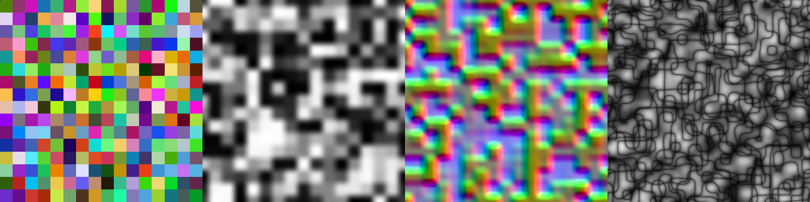

Functions: hash3D (from 1D to 4D), noise, noised and gridNoise.

#### Gradient Noise (Derivatives and configurable Disorder)
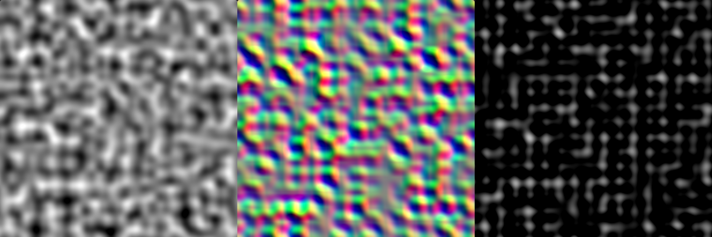

Functions: gradientNoise, gradientNoised and gradientNoiseDisorder.

#### Perlin Noise (Derivatives and variant)
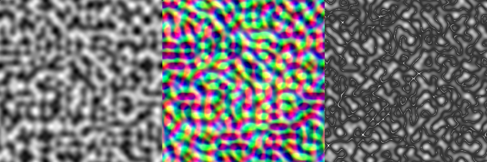

Functions: perlinNoise, perlinNoised and organicNoise.

### Worley Noise

#### Cellular Noise (F1 and F2), Metaballs and Cellular Noise Derivatives
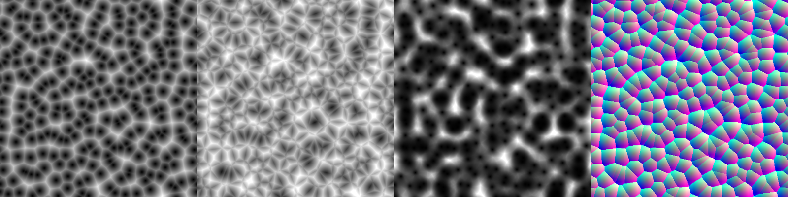

Functions: cellularNoise (F1), cellularNoise (F2), metaballs and cellularNoised.

#### Cellular Noise metrics (Manhattan, Chebyshev and Triangular)
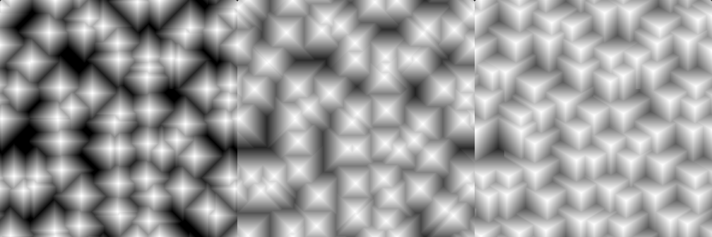

Functions: cellularNoise.

#### Voronoi (minimum edge distance, Cracks, random pattern and IDs)
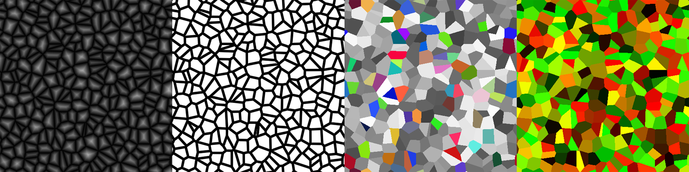

Functions: voronoi, cracks, voronoiPattern and voronoi (tile position of the cell).

#### Hexagons Noise
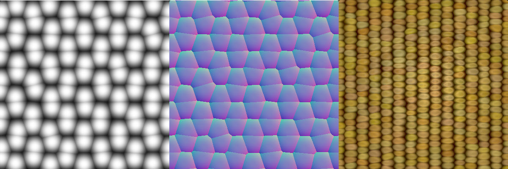

Functions: noiseHexagons and noiseHexagonsd.

### Patterns

#### Checkerboard (plus 45 angle), Random Lines and Dots  
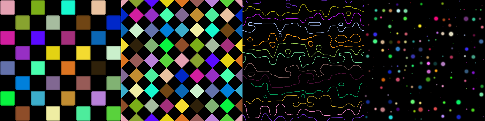

Functions: checkerboard, checkerboard45, randomLines and dotsNoise.

#### Metaballs, Line Waves, Stairs and Cross Pattern
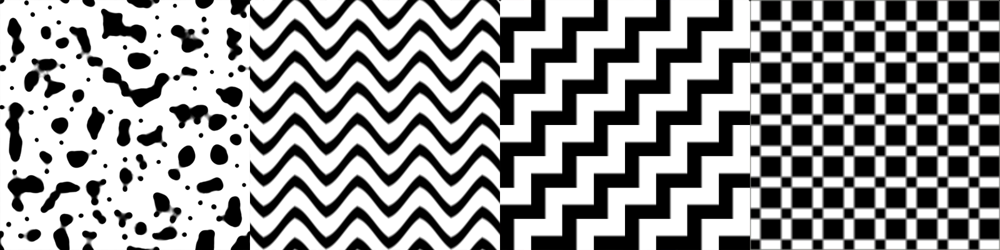

Functions: metaballs, wavePattern, stairsPattern and crossPattern.

#### Tile weaves with normal (Vesica and Capsule)
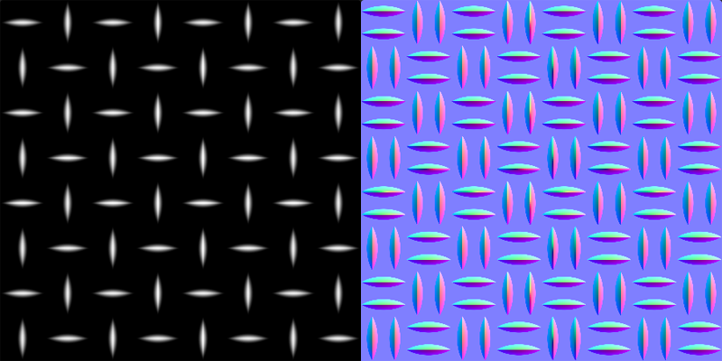

Functions: tileWeave.

#### Tile hexagons (UV, position and edge distance)
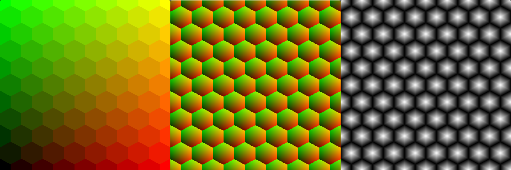

Functions: tileHexagons and tileHexagonsRadii (utility).

### FBM

#### Value Noise, Perlin Noise, Grid Noise and Metaballs 
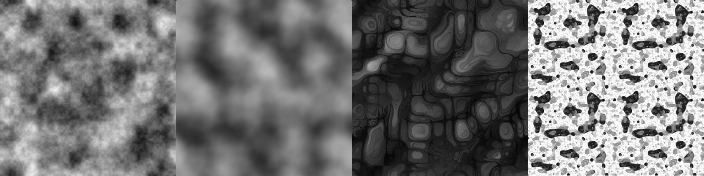

Functions: fbm, fbmPerlin (mode == 4u), fbmGrid and fbmMetaballs.

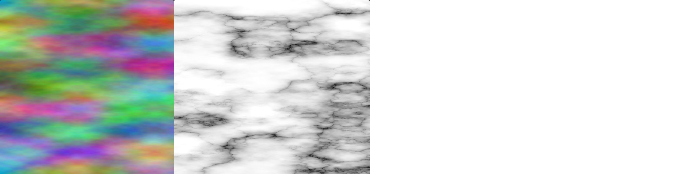

Functions: fbmMulti.

#### Sloped FBMs with derivatives (Value and Perlin)
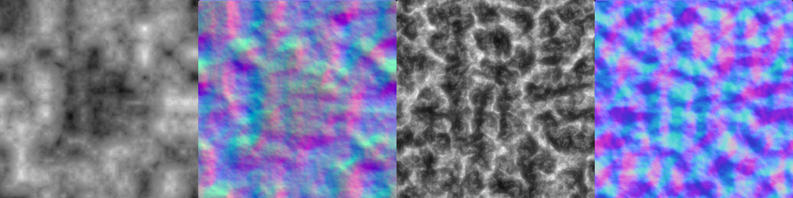

Functions: fbmd and fbmdPerlin.

#### Perlin FBMs (Ridge Multiply, Ridge Add, Perlin Multiply and Perlin Add)
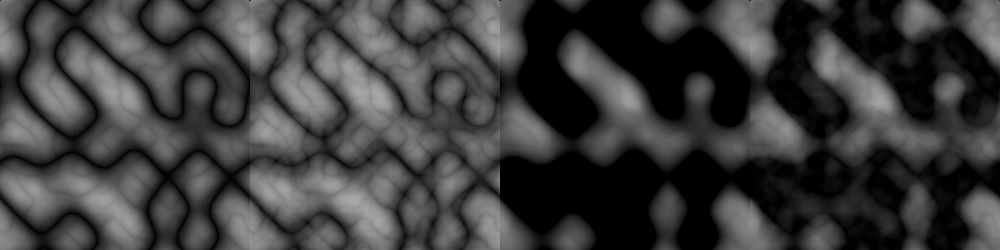

Functions: fbmPerlin (mode: 0u, 1u, 2u, 3u).

#### Image FBMs with derivatives (can be used with image inputs, both grayscale and color)

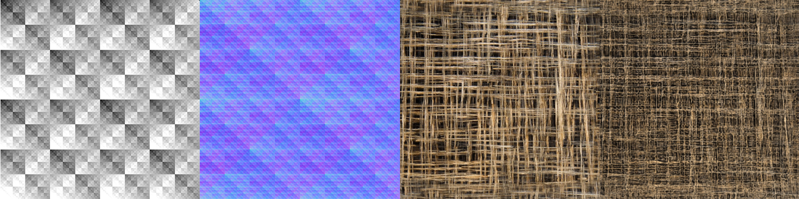

Functions: fbmGrayscaleImaged and fbmImage.

### Domain warp

#### Warping of FBMs (Value noise, Negative Value Noise, Perlin Noise and QR warping)
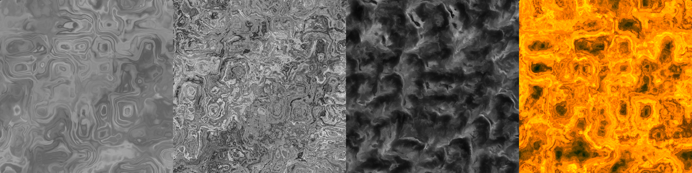

Functions: fbmWarp and fbmPerlinWarp.

#### Q and R factors

The Q and R values of the warp can be used to mix different patterns/colors:
```glsl
    vec2 q, r;
    float f = fbmWarp(p, scale, factors, octaves, shifts, phase, gain, vec2(lacunarity), slopeness, 0.0, true, 0.0, q, r);
        
    col = mix(vec3(0.1,0.5,0.8), vec3(0.6,0.6,0.3), clamp((f * f) * 8.0, 0.0, 1.0));
    col = mix(col, vec3(0.0, 0.1, 0.05), length(q));
    col = mix(col, vec3(0.8, 0.8, 0.8), r.x);
    col = mix(col, col * vec3(0.8, 0.4, 0.2), 0.5 * pow(length(r), 4.0));
``` 

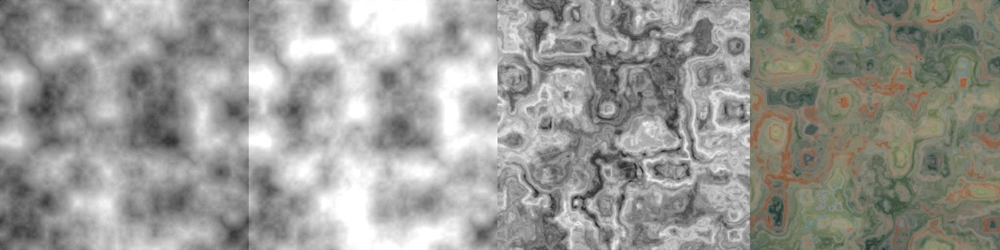

#### Warping variants of Perlin Noise (using dervatives and curl)
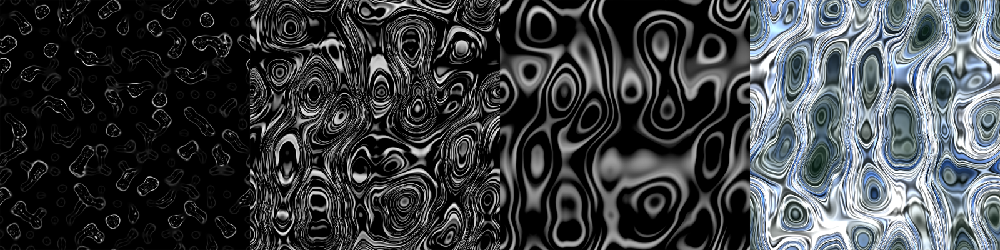

Functions: perlinNoiseWarp and curlWarp.

## Contributing

Based on:
- [Filtering the checkerboard pattern by Inigo Quilez](https://www.iquilezles.org/www/articles/checkerfiltering/checkerfiltering.htm).
- [Value noise derivatives by Inigo Quilez](https://www.iquilezles.org/www/articles/morenoise/morenoise.htm).
- [Voronoi edges by Inigo Quilez](https://www.iquilezles.org/www/articles/voronoilines/voronoilines.htm).
- [2D distance functions by Inigo Quilez](https://www.iquilezles.org/www/articles/distfunctions2d/distfunctions2d.htm).
- [GPU Texture-Free Noise by Brian Sharpe](https://briansharpe.wordpress.com/2011/10/01/gpu-texture-free-noise/).
- [Modifications to Classic Perlin Noise by Brian Sharpe](https://briansharpe.wordpress.com/2012/03/09/modifications-to-classic-perlin-noise/).
- [Hash Functions for GPU Rendering by Mark Jarzynski](http://www.jcgt.org/published/0009/03/02/).

Bug reports and pull requests are welcome on GitHub at https://github.com/tuxalin/procedural-tileable-shaders.

## License

The code is available as open source under the terms of the [MIT License](http://opensource.org/licenses/MIT).